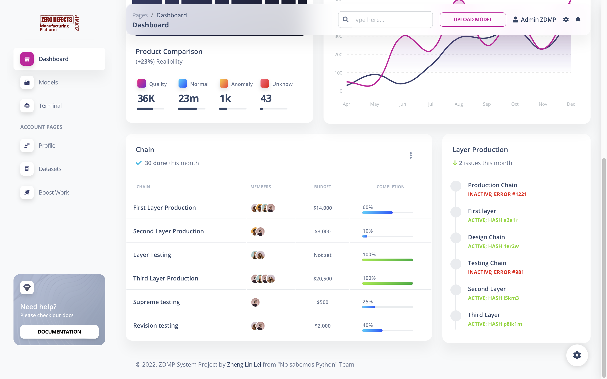

> #### Required Repositories to complete the system
> - [ZDMP-Datasets](https://github.com/ZhengLinLei/ZDMP-datasets)
> - [ZDMP-Client](https://github.com/ZhengLinLei/ZDMP-client) (Pending to be updated)

<br>
<br>
<h1 align="center">ZDMP System</h1>
<br>
<br>
<br>
<p align="center">
    
</p>
<br>
<p align="center">
    <a href="./CONTRIBUTING.md">Contributing</a>
    ·
    <a href="https://github.com/ZhengLinLei/ZDMP/issues">Issues</a>
</p>
<p align="center">
    <a href="https://opensource.org/licenses/Apache-2.0">
        
    </a>&nbsp;
    <a>
        
    </a>
</p>
<br>
<br>


## Table of Contents

- [About the Project](#about-the-project)
- [Requirements](#requirements)
    - [Project](#project)
    - [Components](#components)
- [Getting Started](#getting-started)
    - [Prerequisites](#prerequisites)
    - [Installation](#installation)
    - [Usage](#usage)
        - [Analyze the data](#analyze-the-data)
        - [Run the training and evaluation](#run-the-training-and-evaluation)
        - [Run the server](#run-the-server)
        - [Run the client](#run-the-client)
- [Contributing](#contributing)
- [License](#license)
- [Contact](#contact)
- [Acknowledgements](#acknowledgements)


## About The Project
The ZDMP project is a European project created by a consortium of 40 entities, whose main objective is to provide a reference digital platform for the achievement of the "zero defects" objective, with which it is intended to support quality improvement both both in processes and in products.
Manufacturing high-quality products at low cost is the best way for Europe to maintain leadership in the manufacturing industry and remain competitive in a global marketplace. This industry is in the midst of a digital transformation process, due to the proliferation and increase of new technological solutions, which are incorporated into the production chain to make it more efficient (Smart Factories and industry 4.0).

This is a project that aims to provide a reference digital platform for the achievement of the "zero defects" objective, with which it is intended to support quality improvement both both in processes and in products. All of this content comes from [itic.es](https://www.itic.es/en/) ZDMP [Datathon](https://www.datasciencesociety.net/what-is-the-datathon/) and [Hackaton](https://en.wikipedia.org/wiki/Hackathon).


## Requirements
> #### Required Repositories to complete the system
> - [ZDMP-Datasets](https://github.com/ZhengLinLei/ZDMP-datasets)
> - [ZDMP-Client](https://github.com/ZhengLinLei/ZDMP-client) (Pending to be updated)

### Project
- [Python 3.10](https://www.python.org/downloads/release/python-3100/)
- [Docker](https://www.docker.com/)
- [Docker Compose](https://docs.docker.com/compose/)
- [Git](https://git-scm.com/)

### Components
- [ZDMP-Datasets](https://github.com/ZhengLinLei/ZDMP-datasets)
- [ZDMP-Client](#) (Pending to be updated)
    - [NodeJS](https://nodejs.org/en/)
    - [Express](https://expressjs.com/)


## Getting Started
To train and use the the core of the system you need to follow the next steps.
### Prerequisites
```json
"dependencies": [
    {
        "name": "pandas",
        "version": "1.5.2"
    },
    {
        "name": "scikit-learn",
        "version": "1.2.0"
    },
    {
        "name": "numpy",
        "version": "1.23.5"
    },
    {
        "name": "matplotlib",
        "version": "3.6.2"
    },
    {
        "name": "Flask",
        "version": "2.2.2"
    }
]
```
### Installation
1. Clone the repo
```sh
git clone https://github.com/ZhengLinLei/ZDMP.git
```

2. Install components
```sh
git clone https://github.com/ZhengLinLei/ZDMP-datasets.git
git clone https://github.com/ZhengLinLei/ZDMP-client.git
```

3. Install requirements
```sh
pip install -r requirements.txt
```

4. Get datasets and locate it into the datasets folder

5. Config the .ini
```json
{
    "dataset": {
        "path": "datasets/batch_data.csv",
        "name": "batch_data",
        "predict": "datasets/predict.json",
        "batch_size": 32,
        "shuffle": true
    },
    "build": {
        "path": "build",
        "data": "data.png",
        "model": "model.pkl",
        "module": "pickle"
    },
    "server": {
        "host": "127.0.0.1",
        "port": 5000
    }
}
```

### Usage
#### Analyze the data
To analyze the data run the below script, all analysis can be found in the `src/` folder.
```sh
python src/data.py
```

And you will get the following output as image.


#### Run the training and evaluation
To get the best model run the below script, all models can be found in the `src/models` folder.
```sh
python src/train_eval.py
```

After the training and evaluation process, the data will be printed.
```sh
               Method  Training MSE     Training R2             Test MSE                Test R2        Time
 0  Linear regression      0.026466        0.651201    2603143596.200458    -34521933304.644592          4s
 1      Random forest      0.054894        0.276561             0.053715               0.287655      1m 30s
 2        KNNeighbors      0.000056        0.999266             0.014994               0.801152      1m  2s
 3                SVM      0.044920        0.408009             0.043429               0.424063      6m  4s
```

#### Run the model training
After running the `src/train_eval.py` script, the data sciencetist can choose the best model to train it.
```sh
               Method  Training MSE     Training R2             Test MSE                Test R2        Time
 0  Linear regression      0.026466        0.651201    2603143596.200458    -34521933304.644592          4s ----> Worst model
 1      Random forest      0.054894        0.276561             0.053715               0.287655      1m 30s
 2        KNNeighbors      0.000056        0.999266             0.014994               0.801152      1m  2s ----> Best model
 3                SVM      0.044920        0.408009             0.043429               0.424063      6m  4s
```

Change the `model` variable in the `src/train.py` file to the best model.
```python
# Import KNN model
from models.KNNeighbors import KNNModel

# Create the model
model = KNNModel()
```

To train the model run the below script.
```sh
python src/train.py
```

The model trainned will be saved in the `build` folder.

#### Run the server
To run the server run the below script.
```sh
python src/
```

The server will listen all the request to make predictions. The source of code of prediction can be found in the `src/predict.py` file.
```python
# Create the route
@app.route('/predict', methods=['POST'])
def predict_api():
    # Get the data
    data = request.get_json(force=True)

    # Make prediction
    prediction = predict(data, os.path.join(CURRENT_PATH, CONFIG['model']['path']))

    # Return the prediction
    return jsonify(prediction)
```

#### Run the client
>
>   Read the [ZDMP-Client](https://github.com/ZhengLinLei/ZDMP-client) (Pending to be updated) repository to know how to run the client.
>   The client will send the request to the python server to make predictions.





### Contributing
Contributions are what make the open source community such an amazing place to be learn, inspire, and create. Any contributions you make are **greatly appreciated**.

**How to contribute:**
1. Fork the Project
2. Clone your repository (`git clone repo_url`)
3. Create your Feature Branch (`git checkout -b feature/AmazingFeature`)
4. Commit your Changes (`git commit -m 'Add some AmazingFeature'`)
5. Push to the Branch (`git push origin feature/AmazingFeature`)
6. Open a Pull Request


### License
Distributed under the Apache 2.0 License. See `LICENSE` for more information.


### Contact
Zheng Lin Lei - [zheng9112003@icloud.com](mailto:zheng9112003@icloud.com) | [zheng9112003@gmail.com](mailto:zheng9112003@gamil.com)
Guillermo Breva de Dios - No contact available
Elena Clofent Muñoz - No contact available

Project Link: [https://github.com/ZhengLinLei/ZDMP](https://github.com/ZhengLinLei/ZDMP)


### Acknowledgements
* [ITI](https://www.iti.es/)
* [ZDMP](https://www.zdmp.eu/)
* [UPV](https://www.upv.es/)


### References
* [ZDMP](https://www.zdmp.eu/)
* [ZDMP-Datasets](https://github.com/ZhengLinLei/ZDMP-datasets)
* [ZDMP-Client](https://github.com/ZhengLinLei/ZDMP-client) (Pending to be updated)
* Hackaton 2022 - [ZDMP](https://www.zdmp.eu/)